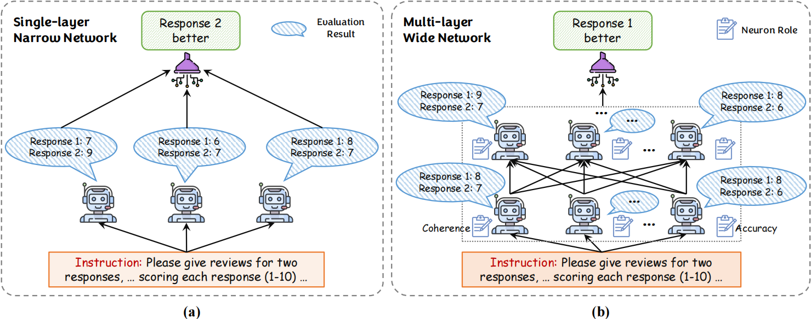
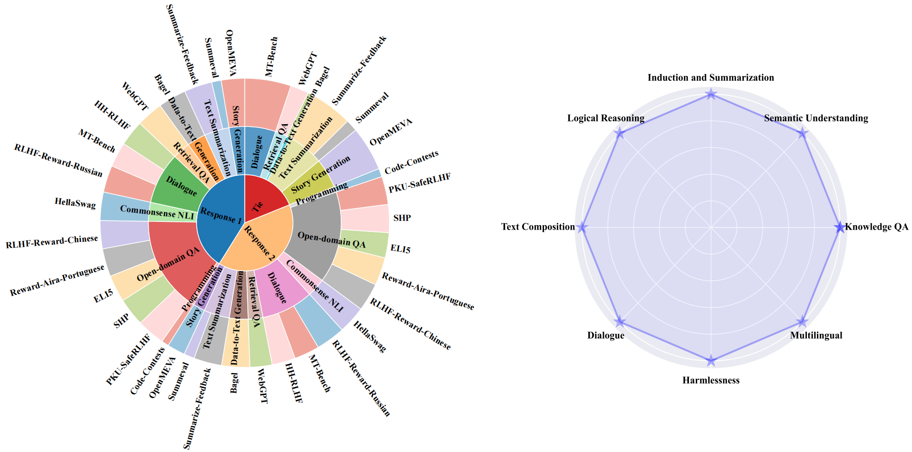

# BroadLLM: Wider and Deeper LLM Networks are Fairer LLM Evaluators
Anonymous Authors
 
## Abstract
Measuring the quality of responses generated by LLMs is a challenging task, particularly when it comes to evaluating whether the response is aligned with human preference. A novel approach involves using the LLM itself to make evaluation and stabilizing the results through multiple independent evaluations, similar to a single-layer narrow LLM network. This network consists of a fixed number of neurons, with each neuron being the same LLM. This paper draws upon the extensive research on deep neural networks to explore whether wider and deeper networks can lead to fairer evaluations. Specifically, inspired by the observation that different neurons in a neural network are responsible for detecting different concepts, we first adaptively generate diverse neuron roles for each evaluation sample. Each perspective corresponds to the role of a specific LLM neuron in the first layer. In subsequent layers, we integrate the locally learned evaluation information from all neurons in the previous layer to obtain a more comprehensive evaluation result. Interestingly, this network design resembles the process of academic paper reviewing, where reviewers rate independently and then consider others’ opinions to reach a final decision. To validate the effectiveness, we construct the largest and most diverse evaluation benchmark LLMEval² for LLM evaluators. Experimental results demonstrate that a wider network with 2 layers performs the best (named as BroadLLM).1 It also boosts Chinese LLM evaluation by 4.6x, saving 60% costs with 93% human agreement.

## BroadLLM



## LLMEval² Benchmark
In this benchmark, 1,050 samples of response 1 are considered to align with human preferences, while another 1,021 samples of response 2 are deemed superior. Additionally, two responses from the 482 samples are considered difficult to differentiate in terms of quality. 



## How to Run
```
cd BroadLLM
mkdir log
unzip LLMEval2_benchmark.json.zip and put LLMEval2_benchmark.json into evaluation_data
sh run_BroadLLM.sh
```
